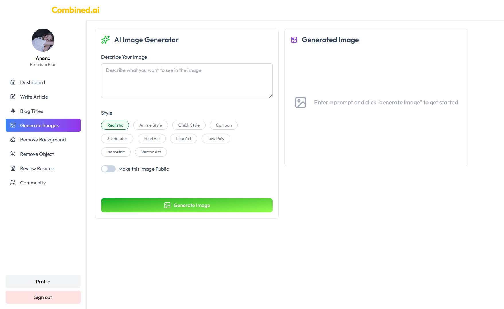
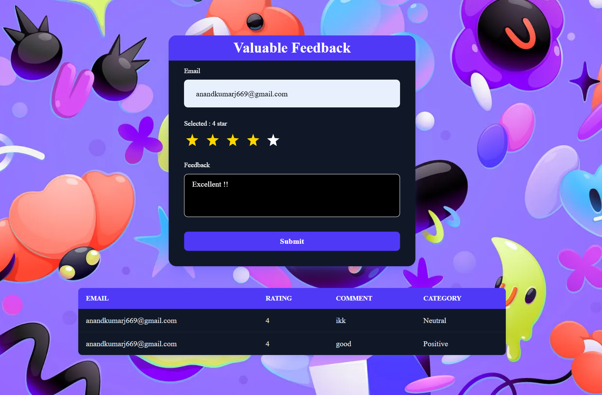
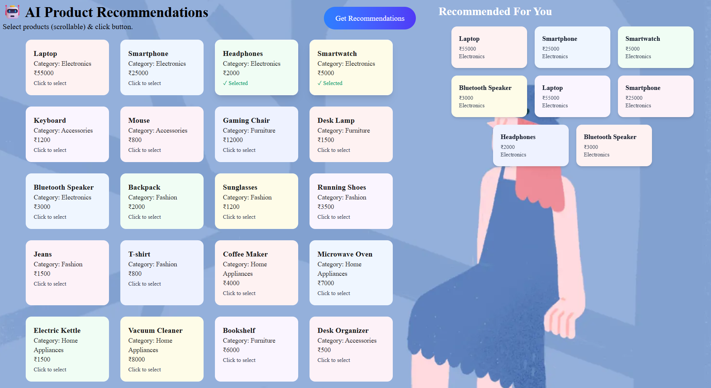

# 🧠 Gen-AI Projects Portfolio  

A growing collection of my AI + automation experiments & tools.  
This repository acts as a showcase of all my Gen-AI projects built using technologies like Google Gemini, n8n, ClipDrop AI, Cloudinary, and more.

---

## 📜 Overview  

Over the past few months I’ve been building a series of projects that explore how Large Language Models (LLMs) and automation frameworks can work together to solve real-world problems quickly and at scale.

This repo contains:

- **Combined AI – Multi-Tool AI Platform**  
- **Feedback System with AI Analysis + n8n + Spreadsheet + Gmail Auto Response + Telegram Integration**  
- **E-Commerce Product Recommendation System using n8n**  

…and more experiments coming soon 🚀.

---

## 🖥️ Projects  

### 1️⃣ Combined AI – Multi-Tool AI Platform  
An all-in-one AI web application. It features text-to-image generation, background and object removal, résumé analysis, and a community section where users can publish and like creations.  
Powered by Google Gemini for LLM responses and ClipDrop AI.  

**Live Demo:** [mycombinedai.vercel.app](https://mycombinedai.vercel.app/)  
**Source Code:** [GitHub Repo](https://github.com/AnandIsCoding/Combined-AI)

---

### 2️⃣ Feedback System with AI Analysis + n8n + Spreadsheet + Gmail Auto Response + Telegram Integration  
A modern feedback system integrating n8n automations, spreadsheets, Gmail auto-response, and Telegram notifications. It demonstrates how AI analysis can automate incoming feedback processing.  

- Collects feedback from multiple channels  
- Stores in spreadsheets for records  
- Uses **Google Gemini** to summarise & classify sentiment  
- Sends personalised auto-responses via Gmail  
- Notifies teams instantly on Telegram  

**Live Demo:** /feedback  
**Source Code:** [GitHub Repo](https://github.com/AnandIsCoding/GenAi)

---

### 3️⃣ E-Commerce Product Recommendation System using n8n  
An AI-powered recommendation engine for e-commerce built with n8n automations. This project showcases a real-life use case of AI Agent workflows to analyse user behaviour, personalise product suggestions, and automate marketing flows.  

- Integrated with external APIs  
- Real-time recommendations  
- Automated marketing actions  

**Live Demo:** /product-recommendation  
**Source Code:** [GitHub Repo](https://github.com/AnandIsCoding/GenAi)

---

## 🧠 How It Works  

Think of **Gemini** as your “brain” in the cloud — a multimodal LLM capable of understanding text, images, or structured data.  
Think of **n8n** as the “nervous system” — it routes signals between services, triggers actions, and keeps everything orchestrated.  

Together they allow you to prototype sophisticated, AI-powered business processes visually, turning what used to be weeks of backend work into an afternoon of drag-and-drop and a few API keys.

---

## 🚀 Roadmap  

- Add more Gen-AI experiments  
- Explore advanced n8n + Gemini use-cases  
- Expand Combined AI platform with new tools  

---

## Anand Jha 🌿
**Portfolio:** [Portfolio](https://anandjii.web.app)

